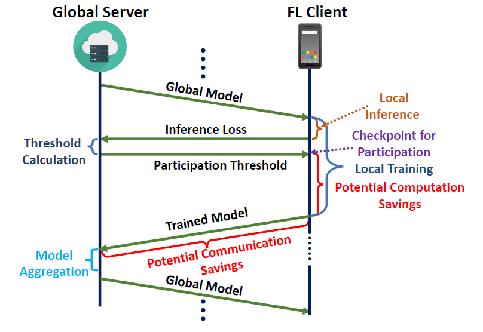

# FedSRC: Computation and Communication Efficient Federated Learning with Self-Regulating Clients

This repository is the official implementation of FedSRC-
<p align="center" width="100%">
    
</p>

>📋 Federated Learning (FL) has emerged as a prominent privacy-
preserving decentralized paradigm for collaborative machine
learning across many devices. However, FL suffers from performance degradation in the global model due to heterogeneity in clients’ locally generated data. Some prior studies ad-
dress this issue by limiting or even discarding certain clients’
contributions to the global model, resulting in unnecessary
computation and communication for the discarded clients.
Alternatively, selectively choosing clients to participate in FL
may avoid such resource waste. But, such active client se-
lection requires client-level profiling that violates privacy. In
this paper, we present a novel FL approach, called FedSRC:
Federated Learning with Self-Regulating Clients, can
save clients’ resources while preserving their anonymity. In
FedSRC, clients can determine if their local train-
ing is favorable to the global model and whether they should
participate in an FL round using a lightweight checkpoint
based on their test loss on the global model. Through comprehensive evaluations using four datasets, we show that
FedSRC can improve global model performance, all the
while reducing communication costs by up to 30% and computation costs by 55%.

## Requirements

To install requirements:

```setup
pip install -r requirements.txt
```
>📋  Getting Dataset Directly
- You can directly download the Dataset for FEMNIST [FEMNIST TRAIN](https://drive.google.com/file/d/1dhwHcwHvgHGraG-OMXzVA4WrpiNLoqAV/view?usp=sharing), [FEMNIST TEST](https://drive.google.com/file/d/1Oe3yEPa2TruLkEOTLsZtipZjERBs-a1M/view?usp=sharing)
- For other datasets, those are processed during training and downloaded online.

Keep the dataset in the same directory of the dataset name.

## Training

To train the model(s) in the paper, navigate to the directory and run this command:


CIFAR10 Non-IID training for FedSRC
```
python fedsrc cifar10 noniid.py
```

>📋 You can control the number of clients, the percentage of bad clients, and the percentage of clients blockig from the code for any algorithms. The code for different algorithms is in different files.

## Evaluation

To evaluate the groupwise performance, run the evaluate.py located in data for every dataset:

```eval
python evaluate.py "file_name"
```

>📋  The file name should include extension ".pkl". This produces the groupwise mean and variance of the test loss for a particular value of q and qms.
## Pre-trained Models

You can download pretrained models here:

- [MNIST](Mnist/pretrain%20model) trained on HeteroFL and FairHeteroFL can be found here. 
- [CIFAR10](Cifar10/pretrain%20model) trained on HeteroFL and FairHeteroFL can be found here. 
- [FEMNIST](Femnist/pretrain%20model) trained on HeteroFL and FairHeteroFL can be found here.
- [SHAKESPEARE](Shakespeare/pretrain%20model) trained on HeteroFL and FairHeteroFL can be found here.

>📋 The pretrained model were the model used to generate the main result in the paper. You also can generate the model using the parameter of q and qms in the paper.

## Results

Our model achieves the following performance on :
<p align="center" width="100%">
    
</p>

>📋  This is the main result of our paper. This shows that with proper tuning of q and qms, we can get more balanced performance accross clients from all the groups with different hardware capabilities. 


## Contributing

>📋  Refer (LICENSE). 
