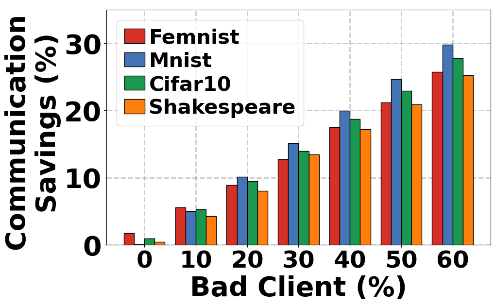
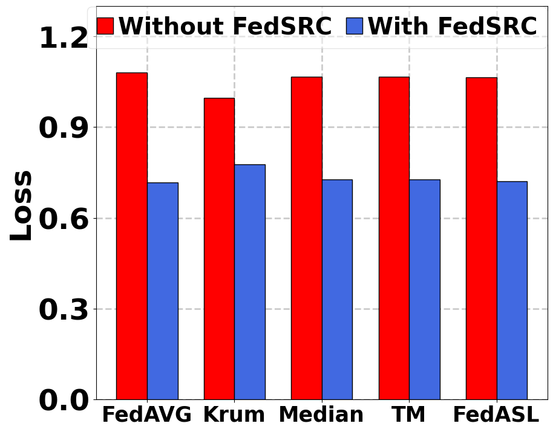

# Empowering Clients: Self-Adaptive Federated Learning for Data Quality Challenges
This repository is the official implementation of FedSRC-

>📋 Federated Learning (FL) suffers from performance degradation in the global model due to the quality and reliability of clients' locally generated data. Some prior studies address this by limiting or discarding certain clients' contributions to the global model, resulting in unnecessary computation and communication for the discarded clients. While active client selection may avoid this resource waste, it requires client-level profiling that violates privacy. In this paper, we present a novel FL approach, called FedSRC: Federated Learning with Self-Regulating Clients, that can save clients' computation and communication resources while preserving their anonymity. In FedSRC, clients determine if their local training is favorable to the global model and whether they should participate in an FL round using a lightweight checkpoint using the local test loss on the global model and refined heterogeneity index (RHI).
Through comprehensive evaluations using four datasets, we show that FedSRC can reduce communication costs by up to 30\% and computation costs by 55\%.
## Requirements

To install requirements:

```setup
pip install -r requirements.txt
```
>📋  Getting Dataset Directly
- You can directly download the Dataset for FEMNIST [FEMNIST TRAIN](https://drive.google.com/file/d/1dhwHcwHvgHGraG-OMXzVA4WrpiNLoqAV/view?usp=sharing), [FEMNIST TEST](https://drive.google.com/file/d/1Oe3yEPa2TruLkEOTLsZtipZjERBs-a1M/view?usp=sharing)
- For other datasets, those are processed during training and downloaded online.

Keep the dataset in the same directory of the dataset name.

## Training

To train the model(s) in the paper, navigate to the directory and run this command:


CIFAR10 Non-IID training for FedSRC
```
python fedsrc cifar10 noniid.py
```

>📋 You can control the number of clients, the percentage of bad clients, and the percentage of clients blockig from the code for any algorithms. The code for different algorithms is in different files.

## Evaluation

Data is saved as the data section with the same directory name at code section. You can evaluate the model performances from there using code like-:

```eval
python cifar10 noniid accuracy.py
```

>📋  You can asses both the accuracy, and loss of the clients as well as the global server along with model weights and other information from the data section.
>
## Pre-trained Models

You can download trained models' weight parameters here to generate the result without training. The weight file is in .pkl format, read the file and set the model weights:

- [MNIST](/Mnist/pretrain%20model/noniid) trained on FedSRC and other algorithms can be found here. 
- [CIFAR10](/Cifar10/pretrain%20model/noniid) trained on FedSRC and other algorithms can be found here. 
- [FEMNIST](/Femnist/pretrain%20model/noniid) trained on FedSRC and other algorithms can be found here.
- [SHAKESPEARE](https://drive.google.com/drive/folders/10jlTg8FhzvWduFYh7t0fMNKcLTmhvMH8?usp=sharing) trained on FedSRC and other algorithms can be found here.

>📋 These models were  used to generate the main result in the paper.


## Results

Our model achieves the following performance on :
<div align="center">
    
    
    
    
</div>


>📋  This is the main result of our paper. This shows that our FedSRC is better than existing  state-of-the-art algorithms in the presence of corrupted clients.

## Comparison of the accuracy of FedSRC with SOTA algorithms

| Algorithms  | MNIST IID | MNIST NonIID | MNIST Extreme | CIFAR IID | CIFAR NonIID | CIFAR Extreme | FEMNIST | Shakespeare |
|-------------|------------|--------------|---------------|-----------|--------------|---------------|---------|-------------|
| FedASL     | 0.973      | 0.971        | 0.942         | 0.556     | 0.556        | 0.488         | 0.746   | 0.511       |
| FedAvg     | 0.971      | 0.969        | 0.936         | 0.548     | 0.552        | 0.491         | 0.749   | 0.499       |
| Krum       | 0.969      | 0.963        | 0.891         | 0.534     | 0.411        | 0.339         | 0.742   | 0.357       |
| Medians    | 0.972      | 0.970        | 0.929         | 0.524     | 0.504        | 0.275         | 0.742   | 0.417       |
| Trimmed mean         | 0.974      | 0.974        | 0.957         | 0.533     | 0.529        | 0.411         | 0.743   | 0.449       |
| FedSRC     | **0.981**  | **0.979**    | **0.969**     | **0.593** | **0.568**    | **0.502**     | **0.780**| **0.524**   |


## Comparison of the Loss of Our Algorithm with SOTA Algorithms

| Algorithms     | MNIST IID     | MNIST NonIID | MNIST Extreme | CIFAR IID    | CIFAR NonIID | CIFAR Extreme | FEMNIST       | Shakespeare  |
| -------------- | ------------- | ------------ | --------------| ------------ | -------------| --------------| ------------- | -------------|
| FedASL         | 0.117         | 0.121        | 0.287         | 1.313        | 1.328        | 1.494         | 1.064         | 1.655         |
| FedAvg         | 0.174         | 0.138        | 0.396         | 1.362        | 1.384        | 1.543         | 1.080         | 1.699         |
| Krum           | 0.098         | 0.116        | 0.342         | 1.330        | 1.815        | 2.183         | 0.996         | 2.315         |
| Medians        | 0.096         | 0.112        | 0.329         | 1.429        | 1.530        | 2.010         | 1.066         | 2.027         |
| TM             | 0.116         | 0.115        | 0.229         | 1.395        | 1.530        | 1.775         | 1.071         | 1.895         |
|FedSRC          | **0.064**    | **0.072**   | **0.119**    | **1.172**   | **1.233**   | **1.495**     | **0.731**    | **1.607**    |

## Computation and Communication Savings

Our model saves both computation and communication cost in presence of bad clients :
<div align="center">
    
    
</div>

## Working in the client side with existing algorithms

Our model can work in the backend with existing algorithms and saves computation and communication cost and improves their performance as well:
<div align="center">
    
    
</div>

## Contributing

>📋  Refer (LICENSE). 
